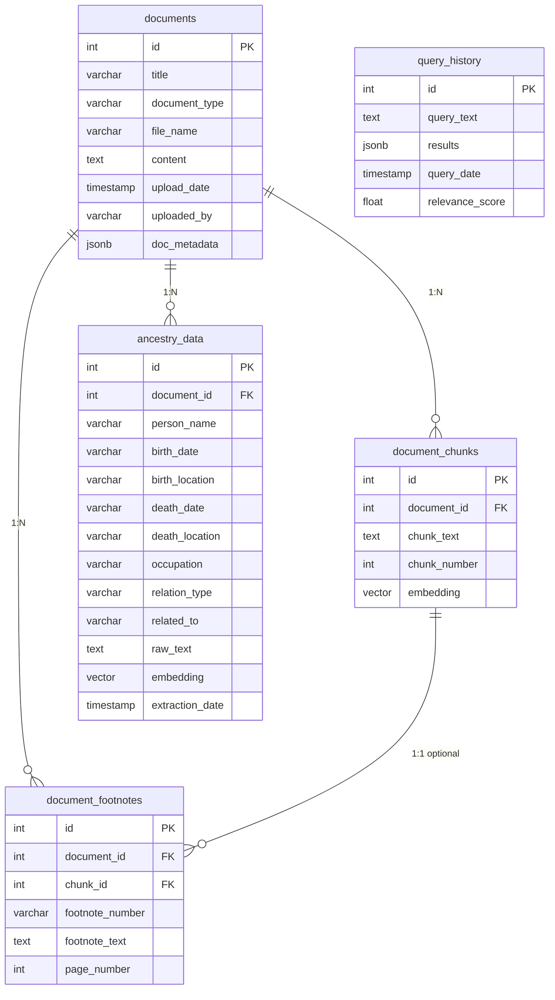

# Architecture Overview

This document provides a high‑level description of the main components and data flow for the Genealogy Ancestry Chatbot application. It complements the README by focusing on how the pieces fit together rather than how to use them.

---

## 1. System Components

### 1.1 Backend API (FastAPI)
- **Location:** `app/backend/`
- **Entry point:** `main.py` - configures FastAPI, mounts routers and database dependency.
- **Routes:**
  - `routes/documents.py` handles document upload, listing, retrieval and deletion.
  - `routes/queries.py` handles search, chat (`/ask`), the LangGraph research agent (`/research`), person/family lookups and history.
- **Services:**
  - `document_processor.py` handles ingestion, text extraction, chunking and entity extraction.
  - `embedding_service.py` wraps the embeddings API — local Ollama `nomic-embed-text` by default, with OpenAI (`text-embedding-3-small`) and Azure Foundry as alternatives.
  - `retrieval_service.py` provides vector similarity searches against pgvector tables plus specialized ancestry queries.
  - `llm_service.py` is responsible for generating chatbot responses using the selected language model — **DeepSeek** by default (primary), with **Groq** as secondary.
  - `agent_orchestration.py` builds the multi-step LangGraph research agent (`/research`) on top of the services above — classify → retrieve → generate → verify → approve.
- **Database models:**
  - Defined in `database.py` (e.g. `Document`, `Chunk`, `AncestryRecord`, `QueryHistory`).
  - Database connection via SQLAlchemy and a `SessionLocal` factory.

### 1.2 Database (Supabase)
- **Supabase** (managed PostgreSQL) with the **pgvector** extension for storing numerical embeddings.
- **Connection:** configured through `DATABASE_URL` in `.env` (Supabase Dashboard → Project Settings → Database → Connection string).
- **Schema:** created by running `database/supabase_setup.sql` in the Supabase SQL Editor, or automatically when the backend starts (`Base.metadata.create_all`).
- **Tables:** Documents, DocumentChunks, AncestryRecords, QueryHistory, DocumentFootnotes.
- Embeddings are stored as vector columns so that similarity queries (cosine distance) can be run inside SQL.

#### Database Schema Diagram

### 1.3 AI/ML Services
- **Embeddings provider:** OpenAI (or locally hosted model) used by `embedding_service`.
- **LLM provider:** The system defaults to the **DeepSeek** API (`deepseek-v4-pro`, OpenAI-compatible endpoint at `https://api.deepseek.com`), with **Groq** as a secondary option. `llm_service` wraps calls to either provider; embeddings come from a separate provider (local Ollama by default) because DeepSeek and Groq do not expose embedding endpoints.
- **Genealogical entity extraction:** A lightweight NLP routine in `DocumentProcessor` that pulls names, dates, relationships, locations, etc. from text using regex or simple heuristics.

### 1.4 Frontend (React)
- **Location:** `app/frontend/src/`
- **Main components:**
  - `Chatbot.js` – conversational UI, calls `/api/queries/ask` and displays sources.
  - `DocumentUpload.js` – file selection and upload form hitting `/api/documents/upload`.
  - `DocumentList.js` – lists uploaded documents with filters.
  - `FamilyTree.js` – fetches family connections via `/api/queries/family/{name}`.
- Served by the React dev server (`npm start`) on port 3000 in development; `npm run build` produces a production bundle that can be served by any static host.

### 1.5 Runtime Environment (venv)
The application runs as plain local processes — no Docker:

1. **Backend** – FastAPI + Uvicorn inside a Python virtual environment (`python -m venv venv`, then `uvicorn main:app --reload`). Port `8000`.
2. **Frontend** – React dev server via `npm start`. Port `3000`.
3. **Database** – hosted **Supabase** PostgreSQL (with pgvector). No local database container.

- **Environment variables** live in `.env` (copied from `.env.example`) and are read by `config.py` via pydantic-settings.
- **Runtime folders:** `uploads/` stores uploaded files; vector data lives in Supabase.

### 1.6 Agent Orchestration (LangGraph)
- **Location:** `app/backend/agent_orchestration.py`
- A stateful LangGraph workflow (`classify → retrieve → generate → verify → approve`) that reuses `embedding_service`, `RetrievalService`, `llm_service`, and the rule-based classifier.
- **Nodes:**
  - `classify` — picks reasoning effort via `rule_based_classify` (default `high` on the research path).
  - `retrieve` — embeds the query and searches chunks + person records.
  - `generate` — drafts the answer and enforces a cumulative token budget (`AGENT_TOKEN_BUDGET`).
  - `verify` — a second LLM pass audits every footnote citation against the retrieved context.
  - `approve` — human-in-the-loop gate; with `REQUIRE_HUMAN_APPROVAL=false` it auto-approves. Rejected drafts loop back to `generate`.
- **State & resume:** runs are checkpointed (`MemorySaver`, swap for a Postgres checkpointer in production) and keyed by `thread_id`; paused runs resume via `POST /api/queries/research/{thread_id}/approve`.
- **Failure behavior:** the `/research` endpoint falls back to the direct RAG path if the agent errors, so callers always receive an answer. Every node records timings and tool calls into `rag_summary.json`.

### 1.7 Document Chunking (fixed vs. semantic)
- **Location:** `document_processor.py` (behind `SEMANTIC_CHUNKING` in `.env` / `config.py`).
- **Fixed window (default):** `CHUNK_SIZE=1000` chars, `OVERLAP=100` — a sliding window over raw extracted text that may split mid-paragraph or across section boundaries.
- **Semantic chunking (opt-in):** blocks are grouped into sections by heading (Word `Heading 1/2/3` styles for DOCX; a title-case / ALL-CAPS heuristic for PDF/TXT/JSON). Consecutive headings nest into breadcrumbs (`Fused Legacies > Life After the War`), long sections are split with overlap applied **only inside the section**, and every chunk is stored with a `Section: ...` breadcrumb prefix so retrieved chunks are self-contained.
- Both paths feed the same embedding + storage pipeline; switching strategies requires re-uploading documents. `rag_evaluation.py` is the A/B instrument for comparing the two (see README).
- **Measured result:** on the 2023 SOFAFEA journal (7 multi-hop/list eval questions), semantic chunking raised context precision 0.68 → 0.79 but dropped context recall 0.48 → 0.32 and average rubric score 1.29 → 1.14. The fixed window + overlap remains the default; `SEMANTIC_CHUNKING` ships as an opt-in experiment.

### 1.8 RAG Evaluation (custom judges + ragas)
- **Location:** `rag_evaluation.py` (repo root); results appended as JSON Lines to `app/backend/rag_evaluation_results.json`.
- Runs every question in `sofafea_rag_eval.md` through the real pipeline and measures retrieval quality (context precision/recall, entity recall), generation quality (faithfulness, answer relevancy, semantic similarity, 0/1/2 rubric), plus per-step timings and cost.
- `--evaluator custom|ragas|both` selects the judge layer: hand-rolled prompts (default) and/or the `ragas==0.2.15` library, which uses DeepSeek via its OpenAI-compatible API and local Ollama embeddings — judge calls and embeddings keep the same privacy/cost posture as production. `--tag` labels A/B variants, and full retrieved contexts are stored per question so both judge layers score the identical inputs.

## 2. Data Flow

1. **Document ingestion:**
   - User uploads a file via frontend or curl.
   - Backend route `POST /api/documents/upload` uses `DocumentProcessor` to extract text, break it into chunks (fixed window or semantic, per `SEMANTIC_CHUNKING`), compute embeddings, and insert both the text and vectors into the database. Genealogical entities are also extracted and stored as `AncestryRecord` entries.

2. **Semantic search and chatbot queries:**
   - When a query is received (`/search` or `/ask`), the backend obtains an embedding for the query text.
   - `RetrievalService` executes vector similarity queries on the `document_chunks` and/or ancestry tables to find top‑k matches.
   - For `/ask` endpoints, the top results are packaged as context and passed to `llm_service.generate_response()`, which composes a prompt and posts it to the LLM. The resulting response and context count are returned to the frontend.
   - All queries are optionally logged in `QueryHistory`.

3. **Agentic research (`/research`):**
   - The LangGraph workflow classifies the query, retrieves context, generates a draft, verifies citations, and (optionally) waits for human approval before returning — with per-node timings and tool calls logged to `rag_summary.json`. On any agent error, the endpoint falls back to the direct `/ask`-style pipeline.

3. **Family/person lookups:**
   - Requests to `/person/{name}` and `/family/{name}` trigger specialized database queries that use indexed ancestry data to locate matching records or connected family members.

4. **Frontend rendering:**
   - Results from API calls are presented in a user‑friendly manner: chat messages with sources, lists of documents, or tree visualizations built from returned records.

## 3. Extensibility Points

- **Adding new document types:** Extend `document_processor` to recognize additional file formats and update the database model.
- **Switching AI providers:** The `embedding_service` and `llm_service` are thin wrappers around provider SDKs; implementing new provider clients is straightforward.
- **Scaling:** The database is already a managed cloud service (Supabase); scale the backend by running multiple Uvicorn workers behind a load balancer and serve the built frontend from a CDN or static host.

## 4. Development Workflow

1. Edit code in `app/backend` or `app/frontend`.
2. Backend: restart Uvicorn (or let `--reload` pick up changes automatically).
3. Frontend: the React dev server hot-reloads on save.
4. Run tests (if added) with `pytest` in the venv or via the frontend's npm scripts.

---

This overview should help contributors and operators understand the high‑level architecture and how the core components interact. For usage examples and detailed setup instructions, refer back to `README.md`.